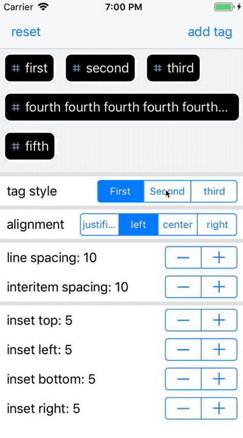
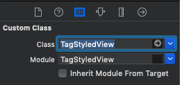

# TagStyledView

[](https://travis-ci.org/dave.pang/TagStyledView)
[](https://cocoapods.org/pods/TagStyledView)
[](https://cocoapods.org/pods/TagStyledView)
[](https://cocoapods.org/pods/TagStyledView)

## Example

To run the example project, clone the repo, and run `pod install` from the Example directory first.



## Requirements

## Installation

TagStyledView is available through [CocoaPods](https://cocoapods.org). To install
it, simply add the following line to your Podfile:

```ruby
pod 'TagStyledView'
```

## Usage

### Setup in Interface Builder

1. In the Identity Inspector, set the layout object's custom class to `TagStyledView`.

    
    
    ```Swift
    @IBOutlet weak var tagStyledView: TagStyledView!
    ```

2. Register a nib file for use in creating new collection view cells.

    ```Swift
    class TagCell1: UICollectionViewCell, TagStyling {
        @IBOutlet weak var tagLabel: UILabel!
    }

    class TagCell2: UICollectionViewCell, TagStyling {
        @IBOutlet weak var tagLabel: UILabel!
    }
    
    class TagCell3: UICollectionViewCell, TagStyling {
        @IBOutlet weak var tagLabel: UILabel!
    }
    ```
    
    ```Swift
    tagStyledView.register(UINib(nibName: TagCell1.Resource.identifier, bundle: nil), forCellWithReuseIdentifier: TagCell1.Resource.identifier)
    tagStyledView.register(UINib(nibName: TagCell2.Resource.identifier, bundle: nil), forCellWithReuseIdentifier: TagCell2.Resource.identifier)
    tagStyledView.register(UINib(nibName: TagCell3.Resource.identifier, bundle: nil), forCellWithReuseIdentifier: TagCell3.Resource.identifier)
    ```

    💡 **Pro Tip:** You must implement the `TagStyling` protocol.
### Setup in code

1. Set tags data.

    ```Swift
    tagStyledView.tags = ["first", "second", "third", "fourth fourth fourth fourth fourth fourth fourth", "fifth"]
    ```

2. Customize `TagStyledView.Options`

    ```Swift
    let options = TagStyledView.Options(sectionInset: .zero,
                                            lineSpacing: 10.0,
                                            interitemSpacing: 10.0,
                                            align: TagStyledView.Options.Alignment.left)
    tagStyledView.options = options
    ```
 
3. Run the app.

### Enjoy! 😎

## Author

dave.pang, yainoma00@gmail.com

## License

TagStyledView is available under the MIT license. See the LICENSE file for more info.
